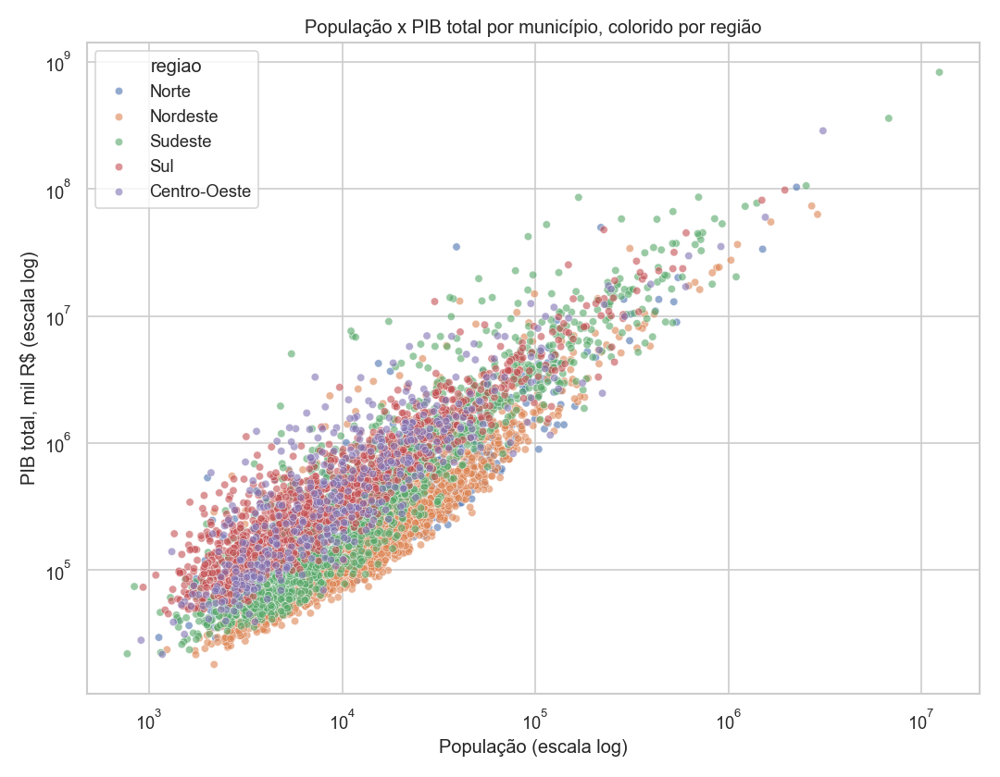
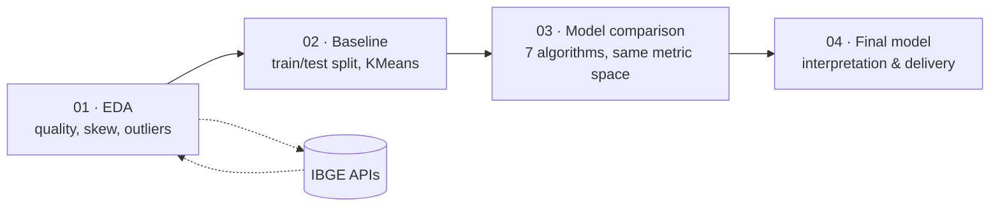
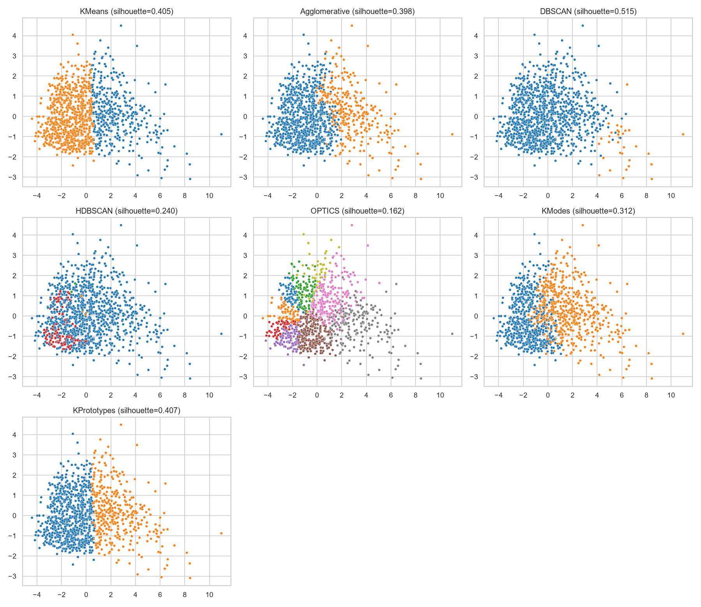
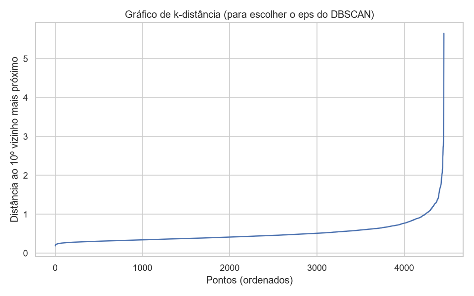
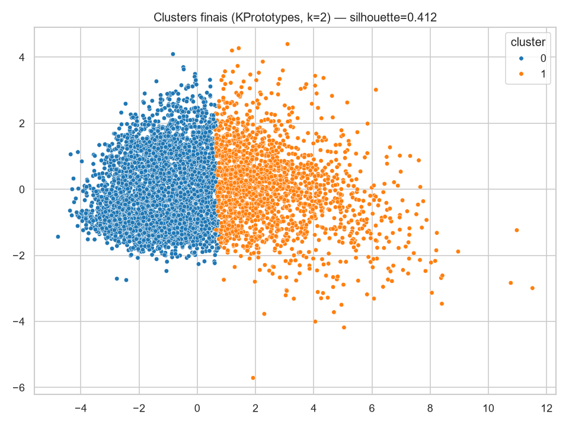

# Brazil in Two Clusters

**What if 5,570 municipalities, 27 states, and five regions collapsed into just two economic tribes — and a machine found them without ever being told what "rich" or "poor" means?**

This project pulls live population and GDP data straight from IBGE's public API, throws seven different clustering algorithms at it, and lets the data settle an old question about Brazil's geography of inequality. No labels, no supervision — just distributions, distances, and a silhouette score keeping everyone honest.

[](https://www.python.org/)
[](https://scikit-learn.org/)
[](https://jupyter.org/)
[](https://dados.gov.br)

---

## The hook

Look at this scatter plot before reading anything else:



That's every Brazilian municipality, population against GDP, both on a log scale. The pattern already jumps out: a dense cloud of small towns, a long tail of major cities, and a visible regional skew — the Northeast piles up on the lower-left, the Southeast dominates the upper-right. The question this project answers is whether an *unsupervised* algorithm — one that never sees the word "região" as a target — rediscovers that same divide on its own.

It does. Keep reading to see how, and which of seven algorithms got there most convincingly.

---

## Table of contents

- [The dataset](#the-dataset)
- [Project pipeline](#project-pipeline)
- [Seven algorithms enter, one wins](#seven-algorithms-enter-one-wins)
- [The verdict: two Brazils](#the-verdict-two-brazils)
- [Repository structure](#repository-structure)
- [Running it yourself](#running-it-yourself)
- [Tech stack](#tech-stack)
- [What's next](#whats-next)

---

## The dataset

No CSV was downloaded by hand for this project. [`src/baixar_dados.py`](src/baixar_dados.py) hits IBGE's official APIs directly — the same government data catalogued on Brazil's [Open Data Portal](https://dados.gov.br) — and builds a fresh dataset of **5,571 municipalities** with:

| Feature | Description |
|---|---|
| `populacao` | Estimated resident population (2021) |
| `pib_total_mil_reais` | Total GDP (thousand BRL) |
| `vab_agropecuaria_mil_reais` | Gross value added — agriculture |
| `vab_industria_mil_reais` | Gross value added — industry |
| `vab_servicos_mil_reais` | Gross value added — services |
| `vab_adm_publica_mil_reais` | Gross value added — public administration |
| `pib_per_capita_reais` | GDP per capita (derived) |
| `uf_sigla`, `regiao`, `mesorregiao`, `microrregiao` | Geographic categorical fields |

Real government data means real government-data problems, and the EDA notebook doesn't hide them: one brand-new municipality has no GDP series yet, and one — Cachoeira Dourada, GO, home to a hydroelectric plant — reports a *negative* industrial value-added, an accounting quirk in IBGE's own series. Both get caught, explained, and handled before any model sees the data. This is the part most tutorials skip.

## Project pipeline



Every notebook does exactly one job — this project takes the "small steps" convention seriously:

1. **[`01_EDA.ipynb`](notebooks/01_EDA.ipynb)** — exploration only, zero modeling. Distributions, correlations, geographic breakdowns, and the data-quality catches above.
2. **[`02_Baseline.ipynb`](notebooks/02_Baseline.ipynb)** — the train/test split happens *before* any transformation, so the scaler never peeks at test data. A first KMeans baseline is tuned via elbow + silhouette.
3. **[`03_Comparacao_Modelos.ipynb`](notebooks/03_Comparacao_Modelos.ipynb)** — seven algorithms, one shared evaluation space, a fair fight (details below).
4. **[`04_Avaliacao_Conclusao.ipynb`](notebooks/04_Avaliacao_Conclusao.ipynb)** — the winning model is retrained on the full dataset, clusters get real names, and the model ships to `models/`.

## Seven algorithms enter, one wins

Comparing clustering algorithms fairly is harder than it sounds — KMeans wants numbers, KModes wants categories, KPrototypes wants both, and DBSCAN doesn't even promise a label for every point. This project's answer: fit every model on the representation it's built for, but **score every one of them in the same standardized numeric space**, so the numbers below are genuinely comparable.

| Model | Silhouette (test) | Calinski-Harabasz | Davies-Bouldin | Clusters | What actually happened |
|---|---:|---:|---:|---:|---|
| **DBSCAN** | **0.515** | 230 | 0.61 | 2 | Technically the highest score — but one "cluster" is a niche of 11 mid-sized cities; it works by disowning outliers as noise |
| **KPrototypes** | 0.407 | 929 | 0.97 | 2 | Best score among models that cover *every* municipality — and it's the only one using the `regiao` field directly |
| KMeans | 0.405 | 929 | 0.98 | 2 | Statistically indistinguishable from KPrototypes |
| Agglomerative | 0.398 | 826 | 0.99 | 2 | Confirms the same split from a completely different algorithmic family |
| KModes | 0.312 | 703 | 1.13 | 2 | Categorical-only — proves that discretizing the numbers away costs real signal |
| HDBSCAN | 0.240 | 10 | 0.70 | 3 | 85-89% of points labeled noise |
| OPTICS | 0.162 | 355 | 1.53 | 9 | 97% noise on train; the "clusters" are handfuls of extreme outliers |



The density-based methods (DBSCAN's runner-up aside, HDBSCAN and OPTICS) mostly failed to find broad structure — because there isn't dense, separable structure to find. Brazilian municipalities form a **continuous gradient** of size and income, not tight islands. That's precisely the kind of finding a plot alone won't tell you, but a k-distance graph will:



**KPrototypes won the final round** — not because it topped the leaderboard (it's in a statistical tie with KMeans), but because it's the only model that folds `regiao` directly into the distance calculation, and every municipality gets a label, no exceptions.

## The verdict: two Brazils

The final model — **KPrototypes, k=2**, trained on all 5,570 municipalities — draws a line that maps cleanly onto a well-documented story about Brazilian inequality:



| | **Cluster 0 — Everyday Brazil** | **Cluster 1 — The Economic Core** |
|---|---|---|
| Share of municipalities | 67.6% (3,767) | 32.4% (1,803) |
| Median population | ~7,300 | ~36,300 (5x larger) |
| Median GDP | ~R$150.6M | ~R$1.22B (8x larger) |
| Median GDP per capita | ~R$17,230 | ~R$37,460 (2.2x larger) |
| Regional lean | Northeast (38%), Southeast (27%), South (20%) | Southeast (36%), South (24%), Northeast (19%) |
| Notable residents | Thousands of small towns most Brazilians have never heard of | São Paulo, Rio de Janeiro, Brasília, Salvador, Fortaleza, Belo Horizonte, Manaus, Curitiba, Recife, Goiânia |

Nobody told the algorithm that Brazil has a Southeast/South economic core and a historically underserved North/Northeast. It found that boundary anyway, purely from population, GDP, and sector composition — and it landed almost exactly where decades of regional economic policy debates say it should.

Full breakdown, including per-cluster boxplots and the region-by-region crosstab, is in [`04_Avaliacao_Conclusao.ipynb`](notebooks/04_Avaliacao_Conclusao.ipynb).

## Repository structure

```
.
├── data/                 # raw & processed data (gitignored — regenerate with src/baixar_dados.py)
├── notebooks/
│   ├── 01_EDA.ipynb
│   ├── 02_Baseline.ipynb
│   ├── 03_Comparacao_Modelos.ipynb
│   └── 04_Avaliacao_Conclusao.ipynb
├── src/
│   ├── baixar_dados.py   # pulls the dataset fresh from IBGE's APIs
│   └── app.py            # FastAPI app serving the final model
├── models/               # trained models (.joblib), gitignored
├── reports/              # generated charts & metric tables, gitignored
├── assets/               # curated images used in this README
└── requirements.txt
```

## Running it yourself

```bash
python -m venv venv
venv\Scripts\Activate.ps1        # Windows PowerShell
# source venv/bin/activate       # macOS/Linux

pip install -r requirements.txt

python src/baixar_dados.py       # fetches fresh data from IBGE into data/
jupyter lab notebooks/           # run 01 -> 02 -> 03 -> 04, in order
```

Each notebook depends on artifacts the previous one writes (train/test splits, the cleaned dataset), so run them in sequence the first time.

### Serving the model

Once `models/final_scaler.joblib` and `models/final_kprototypes.joblib` exist (generated by `04_Avaliacao_Conclusao.ipynb`), spin up the API from the project root:

```bash
uvicorn src.app:app --reload --app-dir .
```

Then check `http://127.0.0.1:8000/docs` for interactive Swagger docs, or `POST /predict` with a municipality's indicators to get its cluster.

## Tech stack

`pandas` · `numpy` · `scikit-learn` · `kmodes` (KModes / KPrototypes) · `hdbscan` · `matplotlib` · `seaborn` · `requests` · `FastAPI` · Jupyter

## What's next

- Push past k=2: explore k=3-5 for finer-grained regional profiles.
- Bring in education and health indicators to move beyond a purely economic lens.
- Cross-check clusters against the Municipal Human Development Index (IDHM) from IPEA/PNUD's Atlas Brasil, also catalogued on [dados.gov.br](https://dados.gov.br).

## Data attribution

Underlying data is public and provided by IBGE (Brazilian Institute of Geography and Statistics), also catalogued on Brazil's [Open Data Portal](https://dados.gov.br).
